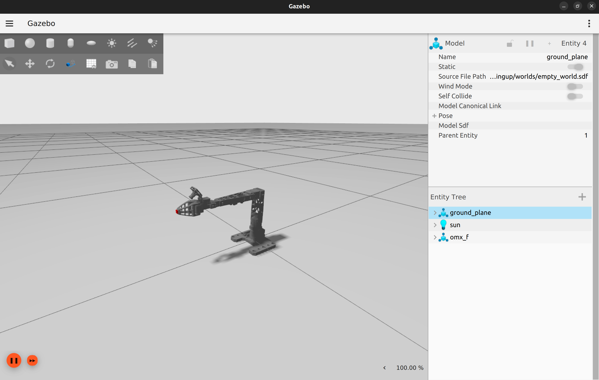
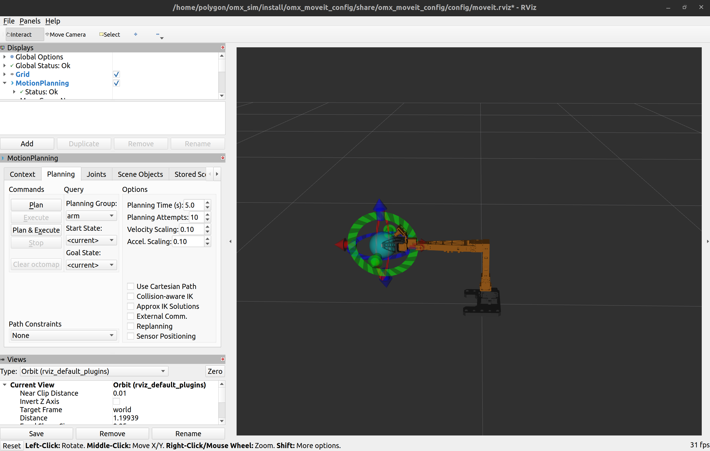

# omx_sim

[](https://github.com/ROBOTIS-GIT/open_manipulator.git)

## Packages

| Package | 설명 |
| --- | --- |
| `omx_description` | URDF/Xacro, 메시, ros2_control, RViz 설정 |
| `omx_bringup` | Gazebo 실행, 컨트롤러, ros_gz 브리지 |
| `omx_moveit_config` | MoveIt SRDF, 플래닝(OMPL/CHOMP/Pilz), 컨트롤러 설정 |

## Requirements

- Ubuntu 22.04 / ROS 2 Humble
- Gazebo (gz sim) + 관련 패키지

```bash
sudo apt install \
  ros-humble-ros-gz \
  ros-humble-gz-ros2-control \
  ros-humble-ros2-control \
  ros-humble-ros2-controllers \
  ros-humble-moveit \
  ros-humble-xacro
```

## Build

```bash
cd ~/omx_sim
colcon build --symlink-install
source install/setup.bash
```

## Run

### 1. Gazebo Simulation

```bash
ros2 launch omx_bringup omx_f_gazebo.launch.py
```



### 2. MoveIt (Rviz + Moveit)

```bash
ros2 launch omx_moveit_config omx_f_moveit.launch.py use_sim:=true
```

